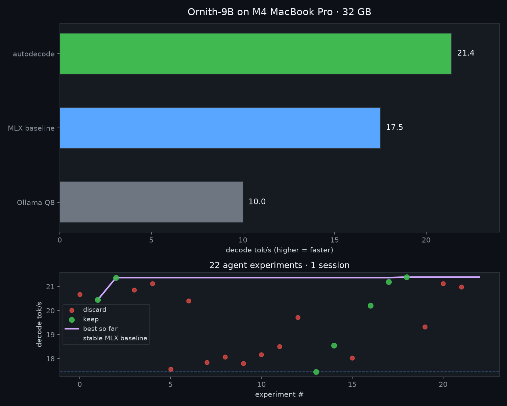
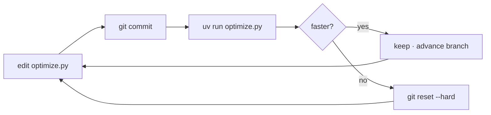

# autodecode

<p align="center">
  <strong>Karpathy-style autonomous research for Apple Silicon inference</strong><br>
  <em>autoresearch trains models overnight. autodecode makes them faster overnight.</em>
</p>

<p align="center">
  <a href="https://github.com/jchacker5/autodecode/releases/tag/v0.1.0"></a>
  <a href="LICENSE"></a>
  
  
</p>

---

I went to sleep and let an AI agent tune my local LLM. I woke up to **2× faster** inference — same weights, same Mac, zero fine-tuning.

**autodecode** is [karpathy/autoresearch](https://github.com/karpathy/autoresearch) adapted for **inference** on MLX: one agent, one editable file, one metric (`decode_tok_s`), commit-or-revert loop.

Validated on **Ornith-9B** (Qwen3.5 hybrid) · **M4 MacBook Pro · 32 GB**.

<p align="center">
  
</p>

---

## The number

| Stack | Decode tok/s | vs Ollama |
|-------|-------------|-----------|
| Ollama Q8 GGUF | **~10** | — |
| MLX 4-bit (thinking off) | **~18** | 1.8× |
| **autodecode winner** | **21.4** | **2.1×** |

22 experiments · 8 kept · ~5.2 GB peak RAM · best config ≈ 15 lines in `optimize.py`

Full log → [RESULTS.md](RESULTS.md) · Agent wiring → [docs/INTEGRATIONS.md](docs/INTEGRATIONS.md)

---

## Why this exists

Most people running Ornith locally hit **~10 tok/s on Ollama** and blame their Mac. Same machine, same model, MLX baseline is **~18 tok/s** before any agent touches config. autodecode pushed that to **21.4** by:

- disabling Qwen3.5 `</think>` reasoning bloat
- `temperature: 0.05` and case-specific code prompts
- `prefill_step_size: 2048` — **not** 4096 or 8192 (bigger was slower)

Your Mac isn't slow. Your stack is misconfigured.

---

## How it works

Three files. Same philosophy as autoresearch.

| File | Role |
|------|------|
| `prepare.py` | Fixed benchmark harness — **do not edit** |
| `optimize.py` | Inference knobs — **agent edits this** |
| `program.md` | Autonomous loop instructions |

```bash
uv run optimize.py > run.log 2>&1
grep "^decode_tok_s:" run.log
# keep commit if faster (+0.15 tok/s noise margin) else git reset --hard
```



---

## Quick start

**Needs:** Apple Silicon, Python 3.11+, [uv](https://docs.astral.sh/uv/), ~6 GB for MLX weights.

```bash
git clone https://github.com/jchacker5/autodecode.git
cd autodecode
uv sync

uv run mlx_lm.convert \
  --hf-path deepreinforce-ai/Ornith-1.0-9B \
  --mlx-path models/ornith-9b-4bit \
  -q --trust-remote-code

uv run optimize.py   # baseline benchmark
```

**Run the agent loop overnight:**

```
Read program.md. Branch autoresearch/<tag>. Loop forever. Only edit optimize.py.
```

```bash
./run_loop.sh opencode
```

---

## Winning config

```python
ENABLE_THINKING = False
TEMPERATURE = 0.05
PREFILL_STEP_SIZE = 2048
WIRED_LIMIT = True
# code_prime → system: "Python only. No prose."
```

---

## Coding agents

```bash
./start-mlx-server.sh   # → http://127.0.0.1:8080/v1
```

Plug into **OpenCode**, **Hermes**, or any OpenAI-compatible client. Configs in [docs/INTEGRATIONS.md](docs/INTEGRATIONS.md).

---

## Fork it

Change `MODEL_PATH` in `prepare.py`, convert any MLX model, point `program.md` at your agent. The loop only cares about `decode_tok_s`.

---

<p align="center">
  Inspired by <a href="https://github.com/karpathy/autoresearch">@karpathy/autoresearch</a> ·
  <a href="https://github.com/ml-explore/mlx-examples">mlx-lm</a> ·
  <a href="https://huggingface.co/deepreinforce-ai/Ornith-1.0-9B">Ornith-9B</a>
</p>

MIT © [Joseph Defendre](https://github.com/jchacker5)